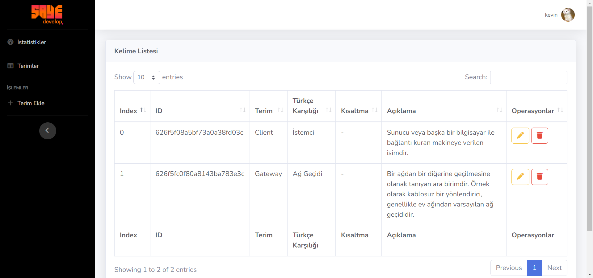

# Dictionary App (Go-MongoDb-Echo)

In this project , we developed book RestAPI and CMS

## Features

- Mongodb
- Echo
- Gorilla/session
- MVC


## Installation

```
$ go get github.com/Yefhem/dictionary-app
```

## How to run

### Required

- MongoDB connection

### Conf

You should modify `.env`

```
# database
DB_USERNAME=   
DB_PASSWORD=     
DB_NAME=
DB_COLLECTION_WORD=
DB_COLLECTION_USER=

# seed information
ADMIN_USERNAME= 
ADMIN_EMAIL=
ADMIN_PASS=

PORT=
```


### Run

```
$ go run dictionary-app/main.go
```

**Project information and existing API**

**API**

```
GET    /api/v1/word/search       --> 
```

**Using API**

```
Query       --> "q"                --> search word (required)
Page Number --> "page_number"      --> desired page (default 1)
Order by    --> "order_by"         --> sort type : "asc" or "desc" (default desc)
```

**Example**

`http://localhost:8080/api/v1/word/search?q=e&order_by=asc&page_number=1`

```
{
    "status": true,
    "code": 200,
    "message": "OK",
    "errors": null,
    "page_model": {
        "page_number": 1,
        "last_page": 1,
        "total": 2
    },
    "data": [
        {
            "ID": "626f5f08a5bf73a0a38fd03c",
            "CreatedAt": "2022-05-02T04:33:12.086Z",
            "Slug": "626f5f08a5bf73a0a38fd03c",
            "English": "Client ",
            "Turkish": "İstemci ",
            "Abbreviation": "-",
            "Description": "Sunucu veya başka bir bilgisayar ile bağlantı kuran makineye verilen isimdir."
        },
        {
            "ID": "626f5fc0f80a8143ba783e3c",
            "CreatedAt": "2022-05-02T04:36:16.434Z",
            "Slug": "626f5fc0f80a8143ba783e3c",
            "English": "Gateway",
            "Turkish": "Ağ Geçidi",
            "Abbreviation": "-",
            "Description": "Bir ağdan bir diğerine geçilmesine olanak tanıyan ara birimdir. Örnek olarak kablosuz bir yönlendirici,  genellikle ev ağından varsayılan ağ geçididir."
        }
    ]
}
```

**CMS**

```
GET    /admin/dashboard          --> 
GET    /admin/new-word           --> 
GET    /admin/word-edit/:id      --> 
POST   /admin/add-word           --> 
GET    /admin/update-word/:id    --> 
POST   /admin/delete-word/:id    --> 
GET    /admin/login              --> 
POST   /admin/user-login         --> 
GET    /admin/user-logout        --> 
```


## Images




